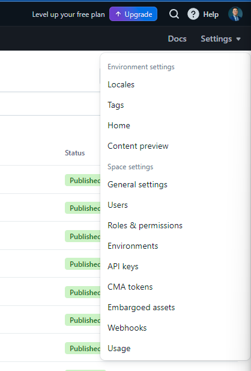
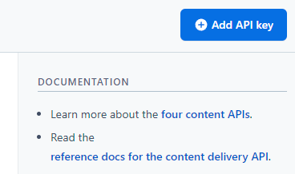

# Seja bem-vindo ao Blog FIAP!

Este projeto demonstra minhas habilidades em Engenharia de Frontend adquiridas na disciplina da Pós Graduação em Engenharia de Software da FIAP. O blog utiliza React e Vite para criar uma interface moderna e responsiva, permitindo a criação, edição e visualização de posts, além de recursos de paginação.

## 🚀 Começando

Essas instruções permitirão que você obtenha uma cópia do projeto em operação na sua máquina local para fins de desenvolvimento e teste.

### 📋 Pré-requisitos

Do que é necessário para subir o ambiente local na sua máquina?

* Node 20
* Git bash instalado e configurado.
* Visual Studio Code versão 1.9.x ou Alguma IDE de sua preferência.

#### Clonar o projeto localmente:

Primeiro você precisa clonar o projeto para a sua máquina local:

```bash
git clone git@github.com:juliocmoliveira/Frontend-Engineering-Blog.git
```

#### Geração de variáveis de ambiente:

No Contentful no canto superior direito da tela você vai precisar ir no caminho: 

Settings > API Keys >

 

Add API Key >



Create API Key (Atribua um nome e uma descrição) >


Serão gerados um Space ID e um access token. Esses dados serão importantes para configuração posterior.


#### Configuração de variáveis de ambiente do Contentful no projeto:

* Crie um arquivo com o nome: .env.local na raiz do projeto.
* Dentro dele atribua as seguintes propriedades, com o ID e token correspondentes, gerados nos passos anteriores:
```
VITE_SPACE_ID=[Space ID]
VITE_ACCESS_TOKEN=[Content Delivery API - access token]
```

***Lembre-se, este arquivo não pode ser subido para o github, isto configura-se uma falha de segurança. Atualmente o arquivo .gitignore do projeto já contempla arquivos deste tipo, porém, certifique-se sempre de que estes dados não estão sendo expostos.***

### 🔧 Instalação

O que você deve executar para ter um ambiente de desenvolvimento em execução.

Com o projeto já clonado na sua máquina...

Abra o git bash ou cmd na pasta do projeto, após isso basta executar o seguinte comando:

```bash
npm run dev
```

O servidor retornará uma URL local que poderá ser acessada para interagir com o sistema, mas normalmente é a seguinte: http://localhost:5173/

## 📦 Implantação

Para implantar este sistema, você vai precisar da pasta dist que será gerada após o comando:

```bash
npm run build
```

## 🛠️ Construído com

* [ViteJS](https://vitejs.dev/) - A ferramenta de construção usada.
* [React](https://react.dev/) - O framework usado para desenvolvimento.
* [Node](https://nodejs.org/en) - Ambiente de execução utilizado.
* [NPM](https://www.npmjs.com/) - Gerenciador de dependências.
* [Contentful](https://www.contentful.com/) - CMS usado para conteúdo dinâmico.
* [Netlify](https://www.netlify.com/) - Cloud usada para fazer [deploy do projeto](https://glistening-trifle-7ffbe3.netlify.app/).


## 📌 Versão

Nós usamos [GIT](https://www.git-scm.com/) para controle de versão. Dê preferência à subir sempre o código fonte da branch **main**, a não ser que você esteja trabalhando em uma branch feature.

## ✒️ Autor

* [Júlio César Morais de Oliveira](https://github.com/juliocmoliveira)


## 🎁 Expressões de gratidão

* Dê uma estrela a este projeto 🌟.